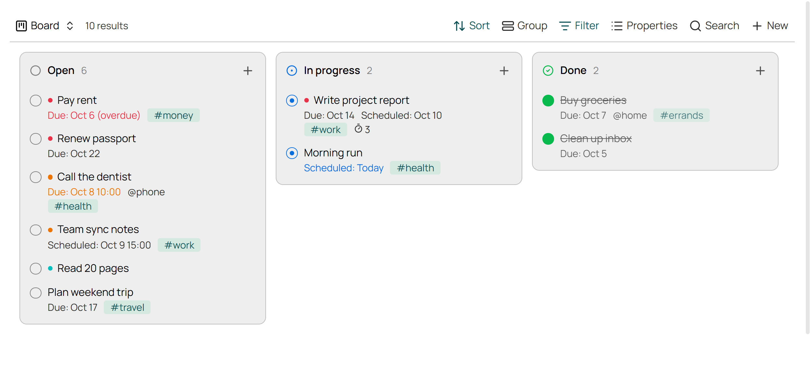
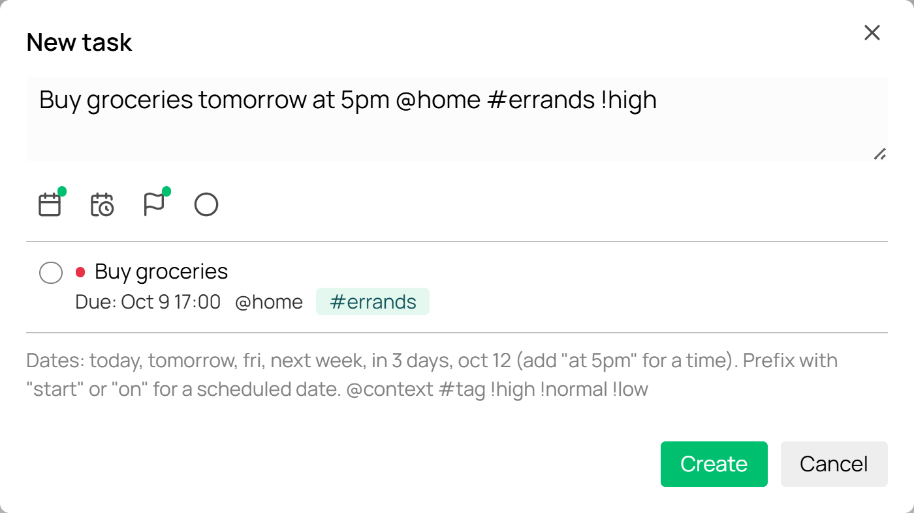
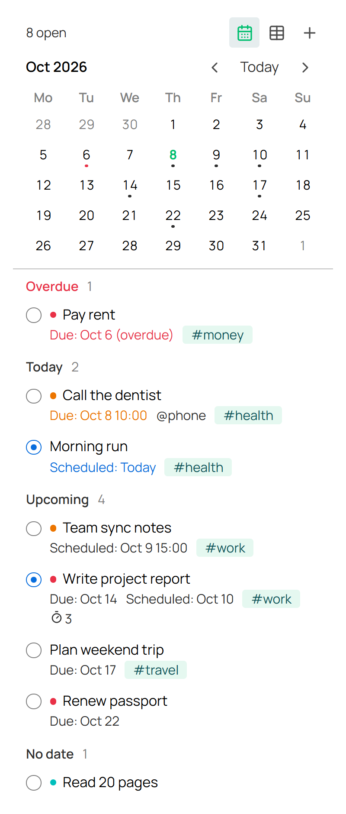
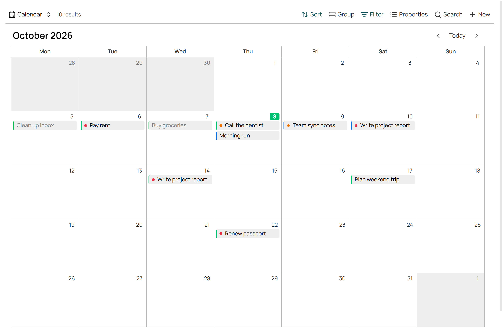
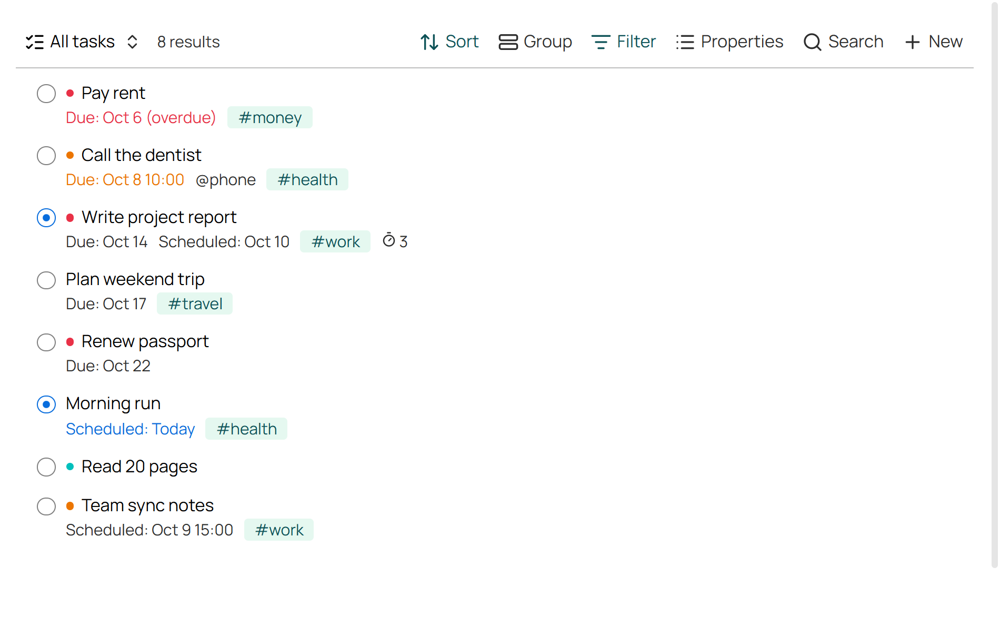
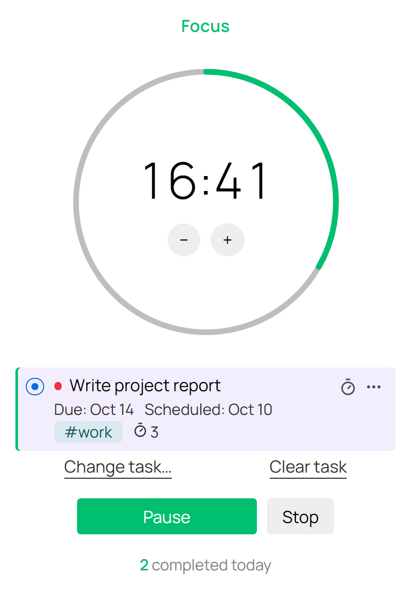

# Tasky

A small, quiet task plugin for Obsidian. Tasks are plain notes, shown in a sidebar panel with a mini calendar and in Bases as a list, a board or a month calendar, with a pomodoro timer in the sidebar.

It's modelled on [TaskNotes](https://github.com/callumalpass/tasknotes): the same idea of one note per task and the same card layout, without calendar sync, recurring tasks, an API or webhooks. It draws everything with your theme's own colours, fonts and controls, so it looks like part of Obsidian.



*Screenshots use sample tasks and the Willemstad theme. Tasky takes on whatever theme you use.*

## What you get

- **Tasks as notes.** Each task is a note in `Tasks/` with a few properties. Nothing is stored anywhere else.
- **Quick add.** Type `Buy groceries tomorrow at 5pm @home #errands !high` and it fills in the date, context, tag and priority. A live preview shows what you'll get.
- **Tasks panel.** A sidebar list made for narrow widths, with a small month calendar on top. Click a day to see what's on it.
- **List view.** A Bases view with TaskNotes-style cards: status circle, priority dot, due and scheduled dates, contexts and tags.
- **Board view.** Open / In progress / Done columns. Drag a card to change its status. In a narrow pane the columns stack.
- **Calendar view.** A month grid with tasks on their due and scheduled days. Drag a task to another day to move it.
- **Pomodoro.** A sidebar timer with a progress ring. Focus on a task, take a short or long break, and finished sessions are counted on the task.

## Getting started

1. Build and install it (see [Install](#install)), then enable **Tasky** under Settings → Community plugins. Bases must be on (Settings → Core plugins).
2. Click the **checklist** icon in the ribbon to open the Tasks panel in the right sidebar.
3. Click **+** in the panel, or run **Tasky: New task**, to add a task.
4. For the bigger views, click the **table** icon in the panel or run **Tasky: Open task views**. The first time, this creates `Tasks/Tasks.base` with five views: Today, All tasks, Board, Calendar and Done.
5. Click the **timer** icon in the ribbon to open the pomodoro panel.

## Tasks



A task is any note tagged `task`. Tasky reads and writes these properties:

```yaml
---
status: open            # open | in-progress | done
priority: high          # high | normal | low (optional)
due: 2026-10-09T17:00   # date, or date and time (optional)
scheduled: 2026-10-08   # optional
contexts: [home]        # optional
tags: [task, errands]
completedDate: 2026-10-09  # set when marked done
pomodoros: 3               # finished focus sessions
---
```

The note's file name is the task's title, and the body is yours for notes.

### Quick add

| Type | Becomes |
| --- | --- |
| `today`, `tomorrow`, `fri`, `next week`, `in 3 days`, `oct 12`, `2026-10-12` | due date |
| `… at 5pm`, `… at 17:30` | adds a time |
| `start mon`, `on fri`, `scheduled tomorrow` | scheduled date instead of due |
| `@home` | context |
| `#errands` | tag |
| `!high`, `!normal`, `!low` (or `!h`, `!n`, `!l`) | priority |

The buttons under the text box set the due date, scheduled date, priority and status by hand. Anything set with a button wins over the text. **Enter** creates the task and **Shift+Enter** adds a new line.

### On a card

- **Status circle:** click to move it on (open → in progress → done → open).
- **Priority dot:** click to change the priority.
- **Card:** click to open the note. Ctrl/Cmd-click opens it in a new tab.
- **Timer icon** (on hover): focus on this task.
- **⋯ or right-click:** status, priority, due and scheduled dates, focus, open in a new tab, delete.

## Tasks panel



The sidebar panel works without Bases and is built for narrow widths.

- **Mini calendar:** a dot marks days with open tasks, red if the day has passed. Click a day to list everything due or scheduled on it, done tasks included. Click it again, or the ×, to go back. The calendar icon in the panel's toolbar hides it.
- **List:** open tasks grouped into **Overdue**, **Today**, **Upcoming** and **No date**, by each task's earliest date, then by priority.
- **+** adds a task. With a day selected, the new task is due that day.

Dates follow your computer's clock, and "Today" rolls over at midnight. Weeks start on the first day of the week for Obsidian's language.

## Views





Tasky adds three view types to Bases: **Task list**, **Task board** and **Task calendar**. Bases still does the filtering, sorting and grouping, so you can change any view from its toolbar or add views of your own to any base.

- **Task list** follows the base's sort and, if set, its grouping. Each group gets a heading.
- **Task board** always has one column per status. The base's sort sets the order within each column. Columns stretch to fill the space and stack when the view is narrower than about 560px.
- **Task calendar** shows one month. Tasks appear on their due day and on their scheduled day; scheduled ones have a blue edge. Drag a task to another day to move that date (its time is kept). Click a day's number to add a task due that day. Days with more than four tasks show "+N more".

The **New** button in the toolbar opens Tasky's quick add instead of creating a blank note.

## Pomodoro



- **Start / Pause / Resume / Stop**, plus − and + to take a minute off or add one.
- **Choose a task** to count sessions against it. Every finished focus session adds 1 to the task's `pomodoros`.
- After a focus session, a break starts by itself: short, or long every 4th session. When the break ends, the timer waits for you to start the next session.
- A chime plays when a session ends. The status bar shows the time left while a session is running or paused. Click it to open the panel.
- The timer keeps running through reloads and sleep.

Session lengths are under Settings → Tasky.

## Commands

- **New task**
- **Open tasks panel**
- **Open task views:** opens `Tasks/Tasks.base`, creating it if it's missing
- **Open pomodoro**
- **Start or pause pomodoro**
- **Stop pomodoro**

## Settings

| Setting | Default |
| --- | --- |
| Tasks folder | `Tasks` |
| Focus length | 25 min |
| Short break | 5 min |
| Long break | 15 min |
| Long break every | 4 sessions |

## Install

The repo is TypeScript only, so build it first (needs Node.js):

```sh
npm install
npm run build   # type check, then bundle src/ into main.js
```

Copy `main.js`, `manifest.json` and `styles.css` into `<vault>/.obsidian/plugins/tasky/`, then enable **Tasky**.

Needs Obsidian 1.10.2 or newer (Bases with custom views).

## Develop

`npm run dev` rebuilds `main.js` on every save. Copy it into the vault's plugin folder and reload the plugin to try a change.

`npm run lint` runs Obsidian's official review rules ([eslint-plugin-obsidianmd](https://github.com/obsidianmd/eslint-plugin)), the same kind of checks the Community directory runs on every release.

| File | What it does |
| --- | --- |
| `src/main.ts` | Plugin setup, commands, settings, the default `Tasks.base` |
| `src/tasks.ts` | Reading, creating and updating task notes |
| `src/parse.ts` | Quick-add parsing |
| `src/card.ts` | The task card and its menus |
| `src/views.ts` | The Bases list, board and calendar views |
| `src/panel.ts` | The sidebar Tasks panel |
| `src/calendar.ts` | The month grid shared by the panel and the calendar view |
| `src/modals.ts` | Quick add and the task picker |
| `src/pomodoro.ts` | Timer, sidebar panel and status bar |
| `styles.css` | All styling, using only theme variables |

## Releasing

1. Bump `version` in `manifest.json` (e.g. `1.0.1`) and commit.
2. Push a tag with exactly that version: `git tag 1.0.1 && git push origin 1.0.1`.
3. The **Release** workflow lints, builds and creates a draft GitHub release with `main.js`, `manifest.json` and `styles.css` attached. Check it and publish it.

## License

MIT
